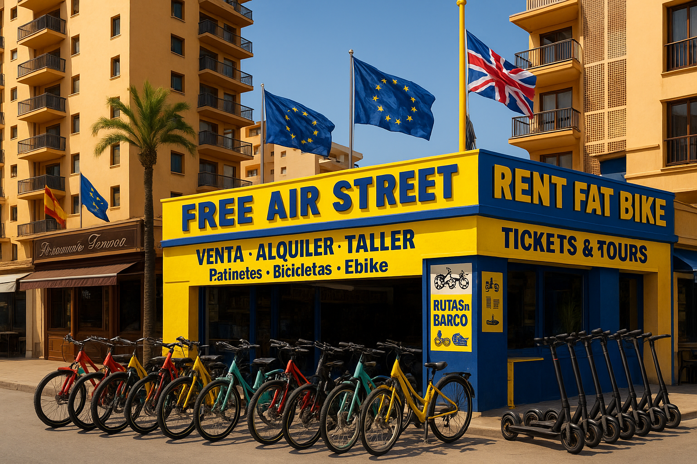

# 🛴 Free Air Street Rental - Plataforma de Alquiler de Vehículos



## 📋 Descripción

**Free Air Street Rental** es una plataforma web moderna y completa para el alquiler de vehículos y servicios turísticos en la Costa del Sol, España. La aplicación ofrece una experiencia de usuario intuitiva con soporte multiidioma (Español/Inglés) y modo oscuro/claro.

## 🌟 Características Principales

### 🚲 Alquiler de Vehículos
- **Bicicletas**: Urbanas, de montaña, eléctricas y fat bikes
- **Coches**: Desde compactos hasta familiares (Toyota Aygo, Seat León, etc.)
- **Motos y Scooters**: Desde 50cc hasta 650cc con modelos premium
- **Quads**: Para aventuras todo terreno
- **Accesorios**: Cascos, candados, sillas para niños

### 🏛️ Tours y Excursiones
- **Excursiones culturales**: Alhambra, Córdoba, Sevilla, Ronda
- **Tours internacionales**: Gibraltar, Tánger
- **Actividades marítimas**: Avistamiento de delfines, fiestas en barco
- **Experiencias únicas**: Paseos a caballo, Caminito del Rey

### 💼 Servicios Adicionales
- **Reparaciones**: Servicio técnico especializado
- **Reservas online**: Sistema de reservas integrado con EmailJS
- **Chat de soporte**: Asistente virtual AirX
- **Códigos QR**: Para reservas rápidas

## 🛠️ Tecnologías Utilizadas

### Frontend
- **Next.js 14** - Framework React con App Router
- **TypeScript** - Tipado estático
- **Tailwind CSS** - Estilos utilitarios
- **Radix UI** - Componentes accesibles
- **Lucide React** - Iconografía moderna

### Funcionalidades
- **Mapbox GL JS** - Mapas interactivos 3D
- **EmailJS** - Envío de emails sin backend
- **Context API** - Gestión de estado global
- **Responsive Design** - Adaptable a todos los dispositivos

### Herramientas de Desarrollo
- **ESLint** - Linting de código
- **PostCSS** - Procesamiento de CSS
- **Geist Font** - Tipografía moderna

## 📁 Estructura del Proyecto

```
free-air-street-rental/
├── app/                          # App Router de Next.js
│   ├── alquiler/                # Página de alquiler de vehículos
│   ├── contacto/                # Página de contacto
│   ├── tienda/                  # Página de tienda
│   ├── tours/                   # Página de tours y excursiones
│   ├── globals.css              # Estilos globales
│   ├── layout.tsx               # Layout principal
│   └── page.tsx                 # Página de inicio
├── components/                   # Componentes reutilizables
│   ├── ui/                      # Componentes de UI (Radix)
│   ├── AirXChat.tsx             # Chat de soporte
│   ├── GlobalModals.tsx         # Modales globales
│   ├── LanguageToggle.tsx       # Selector de idioma
│   ├── RepairQuoteModal.tsx     # Modal de presupuesto reparación
│   ├── ReservationModal.tsx     # Modal de reservas
│   ├── ThemeToggle.tsx          # Selector de tema
│   └── theme-provider.tsx       # Proveedor de tema
├── contexts/                     # Contextos de React
│   ├── LanguageContext.tsx      # Contexto de idioma
│   ├── ModalContext.tsx         # Contexto de modales
│   └── ThemeContext.tsx         # Contexto de tema
├── lib/                         # Utilidades y configuración
│   ├── emailjs.ts               # Configuración EmailJS
│   └── utils.ts                 # Utilidades generales
├── public/                      # Archivos estáticos
│   ├── coches/                  # Imágenes de coches
│   ├── destinos/                # Imágenes de destinos
│   ├── lugares/                 # Imágenes de lugares
│   ├── motos/                   # Imágenes de motos
│   └── ...                      # Otras imágenes
└── hooks/                       # Hooks personalizados
    ├── use-mobile.ts            # Hook para detectar móvil
    └── use-toast.ts             # Hook para notificaciones
```

## 🚀 Instalación y Configuración

### Prerrequisitos
- Node.js 18+ 
- npm, yarn o pnpm

### Pasos de Instalación

1. **Clonar el repositorio**
```bash
git clone https://github.com/tu-usuario/free-air-street-rental.git
cd free-air-street-rental
```

2. **Instalar dependencias**
```bash
npm install
# o
yarn install
# o
pnpm install
```

3. **Configurar variables de entorno**

Crea un archivo `.env.local` en la raíz del proyecto:

```env
# Mapbox (para el mapa interactivo)
NEXT_PUBLIC_MAPBOX_ACCESS_TOKEN=tu_token_de_mapbox

# EmailJS (para el envío de emails)
NEXT_PUBLIC_EMAILJS_SERVICE_ID=tu_service_id
NEXT_PUBLIC_EMAILJS_TEMPLATE_ID=tu_template_id
NEXT_PUBLIC_EMAILJS_PUBLIC_KEY=tu_public_key
```

4. **Ejecutar en modo desarrollo**
```bash
npm run dev
# o
yarn dev
# o
pnpm dev
```

5. **Abrir en el navegador**
```
http://localhost:3000
```

## ⚙️ Configuración de Servicios

### Mapbox
1. Crear cuenta en [Mapbox](https://www.mapbox.com/)
2. Obtener token de acceso
3. Añadir el token a las variables de entorno

### EmailJS
1. Crear cuenta en [EmailJS](https://www.emailjs.com/)
2. Configurar servicio de email
3. Crear plantillas para reservas y contacto
4. Obtener credenciales y añadir a variables de entorno

Para más detalles, consulta [EMAILJS_SETUP.md](./EMAILJS_SETUP.md)

## 📱 Funcionalidades Detalladas

### Sistema de Reservas
- **Modal de reserva unificado** para todos los servicios
- **Formulario completo** con validación
- **Envío automático de emails** de confirmación
- **Selección de fechas y horarios**
- **Cálculo automático de precios**

### Gestión de Vehículos
- **Catálogo completo** con imágenes y especificaciones.
- **Sistema de precios dinámico** por duración.
- **Filtros por categoría** (bicicletas, coches, motos, etc.)
- **Modelos diferenciados** (básico, medio, premium) para scooters
- **Características detalladas** de cada vehículo

### Experiencia de Usuario
- **Diseño responsive** para móvil, tablet y desktop
- **Modo oscuro/claro** con persistencia
- **Multiidioma** (Español/Inglés)
- **Navegación intuitiva** con tabs y filtros
- **Animaciones suaves** y transiciones

### Mapa Interactivo
- **Vista 3D del globo** con animación
- **Localización exacta** del negocio
- **Marcador personalizado** con emoji de scooter
- **Efectos atmosféricos** para mayor realismo

## 🎨 Personalización

### Temas
La aplicación soporta modo claro y oscuro con:
- Persistencia en localStorage
- Transiciones suaves
- Colores adaptativos

### Idiomas
Sistema de internacionalización con:
- Contexto de idioma global
- Traducciones dinámicas
- Persistencia de preferencia

### Estilos
Utiliza Tailwind CSS con:
- Clases utilitarias
- Componentes personalizados
- Variables CSS para temas

## 📊 Scripts Disponibles

```bash
# Desarrollo
npm run dev          # Servidor de desarrollo

# Producción
npm run build        # Construir para producción
npm run start        # Servidor de producción

# Calidad de código
npm run lint         # Ejecutar ESLint
```

## 🌐 Despliegue

### Vercel (Recomendado)
1. Conectar repositorio a Vercel
2. Configurar variables de entorno
3. Desplegar automáticamente

### Otros Proveedores
- **Netlify**: Compatible con Next.js
- **Railway**: Soporte completo
- **DigitalOcean**: App Platform

## 🤝 Contribución

1. Fork el proyecto
2. Crear rama para feature (`git checkout -b feature/nueva-funcionalidad`)
3. Commit cambios (`git commit -m 'Añadir nueva funcionalidad'`)
4. Push a la rama (`git push origin feature/nueva-funcionalidad`)
5. Abrir Pull Request

## 📝 Licencia

Este proyecto está bajo la Licencia MIT. Ver el archivo [LICENSE](LICENSE) para más detalles.

## 📞 Contacto

- **Email**: info@freeairstreet.com
- **Teléfono**: +34 XXX XXX XXX
- **Ubicación**: Costa del Sol, España

## 🙏 Agradecimientos

- [Next.js](https://nextjs.org/) por el framework
- [Tailwind CSS](https://tailwindcss.com/) por los estilos
- [Radix UI](https://www.radix-ui.com/) por los componentes
- [Mapbox](https://www.mapbox.com/) por los mapas
- [EmailJS](https://www.emailjs.com/) por el servicio de email
- [Lucide](https://lucide.dev/) por los iconos

---

**Desarrollado con ❤️ para Free Air Street Rental**